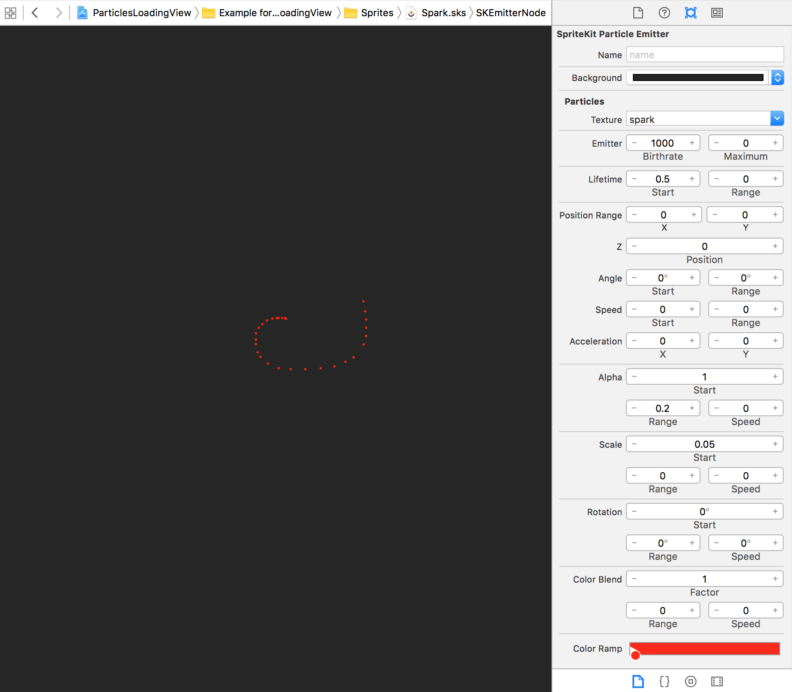

# ParticlesLoadingView

[](https://github.com/Carthage/Carthage)
[](http://cocoapods.org/pods/ParticlesLoadingView)
[](http://cocoapods.org/pods/ParticlesLoadingView)
[](http://cocoapods.org/pods/ParticlesLoadingView)

<p align="center"></p>

## Description
With `ParticlesLoadingView` you can create your own amazing `SpriteKit` particles animations with the Xcode's built-in [Particle Emitter Editor](https://developer.apple.com/library/ios/documentation/IDEs/Conceptual/xcode_guide-particle_emitter/Introduction/Introduction.html) that looks like the following picture.
Go ahead and create your own particles animation by doing File ➡️ New File ➡️ iOS Resource ➡️ SpriteKit Particle File.




## Usage
To see it in action, run the example project, clone the repo, and run `pod install` from the `Example` directory first. The example project shows how to set up `ParticlesLoadingView` in a few different ways. 

The easiest way to add a particles animation around the border of any `UIView` subclass is to use the extension method as follows:

```swift

let view = ... // Your UIView subclass here
view.addParticlesAnimation(effect: ParticleEffect.Fire) // Use a built-in effect
view.addParticlesAnimation(emitter: emitter) // Use your own SKEmitterNode
```

You can also use the already provided `ParticlesLoadingView` class to create an animation. Instantiate it by code or in Storyboard and select a built-in `ParticleEffect` or set the `scene.emitterNode` to your custom `SKEmitterNode` object.

```swift
var loadingView: ParticlesLoadingView = {
    let view = ParticlesLoadingView(frame: 0, y: 0, width: 75, height: 75))
    view.particleEffect = .Spark
    view.duration = 1.5
    view.layer.cornerRadius = 15.0
    return view
}()

// OR provide your own SKEmitterNode

let emitter = NSKeyedUnarchiver.unarchiveObjectWithFile(NSBundle.mainBundle().pathForResource("Spark", ofType: "sks")!) as? SKEmitterNode
if let emitter = emitter { 
    loadingView.scene.emitterNode = emitter
   	loadingView.startAnimating()
}
```
 
## Customizations

```swift
/// Duration in seconds of the animation to complete a tour on the border of the view.
public var duration = 2.0
    
/// The size of each particle image. This value is used to calculate the inner padding of the view path so that the emitted particles are visible.
public var particlesSize: CGFloat = 5.0
    
/// The emitter of particles that is animated along the border of the view.
public var emitterNode: SKEmitterNode? = nil
```
You can provide your own particle emitter node by designing an animation with the particle emitter editor and creating a `SKEmitterNode`.
If you want to customize it further than that, the project is documented so go ahead and [🍴](https://github.com/BalestraPatrick/ParticlesLoadingView#fork-destination-box) it.

If you think a feature should be included in this project, submit a PR or open a new issue.

## Installation

`ParticlesLoadingView` is available through [CocoaPods](http://cocoapods.org). To install
it, simply add the following line to your `Podfile`:

```ruby
pod "ParticlesLoadingView"
```

You can also use [Carthage](https://github.com/Carthage/Carthage) if you prefer. Add this line to your `Cartfile`.

```ruby
github "BalestraPatrick/ParticlesLoadingView"
```
## Requirements
iOS 9.0 and Swift 3 are required. 

If you are using Swift 4, please use the [swift4 branch](https://github.com/BalestraPatrick/ParticlesLoadingView/tree/swift4).

If you are using Swift 2.3, please use the [swift2.3 branch](https://github.com/BalestraPatrick/ParticlesLoadingView/tree/swift2.3).

## Author

I'm [Patrick Balestra](http://www.patrickbalestra.com).
Email: [me@patrickbalestra.com](mailto:me@patrickbalestra.com)
Twitter: [@BalestraPatrick](http://twitter.com/BalestraPatrick).

## License

`ParticlesLoadingView` is available under the MIT license. See the [LICENSE](LICENSE) file for more info.
